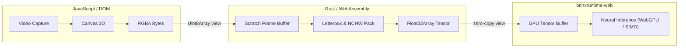

# System Architecture

An in-depth look at how `vigilo-wasm` structures computation across WebAssembly, `onnxruntime-web`, and the browser's JavaScript event loop.

---

## The Target-Web Model

Previous iterations of WASM packages often relied on `--target bundler`. That approach produces an ES module that statically imports the `.wasm` file (`import * as wasm from './module.wasm'`), which is a Webpack/Vite extension rather than a standard web platform feature. It fails completely in vanilla browsers and prevents callers from awaiting module instantiation.

`vigilo-wasm` compiles with **`wasm-pack --target web`**:
- The generated JS contains an explicit `initWasm()` function that accepts a URL, `Response`, or byte array.
- Callers await `initVigilo()` at whatever point suits their application lifecycle (e.g. during a splash screen or route transition).
- Works identically under Vite, Next.js, Webpack, Bun, or a vanilla `<script type="module">`.

---

## Memory Layout & Buffer Sharing

Transferring large image buffers between JavaScript and WebAssembly can easily become a major performance bottleneck if done carelessly.

1. **Camera to WASM**: `camera.grab()` provides an `ImageData` buffer. `pipeline.beginFrame()` receives a `Uint8Array` view pointing directly at this memory.
2. **Preprocessing in Rust**: Letterbox scaling, aspect ratio correction, BGR/RGB conversion, and NCHW channel transposition are executed in compiled Rust, populating a pre-allocated `Float32Array`.
3. **WASM to ONNX**: The resulting `Float32Array` view is handed directly to `new ort.Tensor('float32', data, dims)`, avoiding redundant array copies.
4. **Postprocessing in Rust**: Output tensors are passed back to Rust via `TensorBag`, where anchor decoding and NMS execute in native WebAssembly speed.

---

## The Single-Threaded Browser Constraint

Natively, `vigilo-core` runs four background threads:
- **Worker 1**: Capture & Face Detection (30 Hz)
- **Worker 2**: Head Pose & Gaze (30 Hz)
- **Worker 3**: Prohibited Objects (1 Hz)
- **Worker 4**: Temporal Fusion & Event Dispatch

In a browser tab, everything runs inside a **single JavaScript main thread**. To maintain a fluid user experience:
- **Self-Correcting Schedule**: Each tick calculates its elapsed time and schedules the next tick at `period - elapsed`, absorbing jitter instead of accumulating delays.
- **Drop-Not-Queue Guarantee**: `CameraSource` maintains no buffer. If inference takes longer than expected, the next frame is sampled live from the camera, ensuring bounded latency.
- **Cadence Divisors**: Heavy models run on fractional cadences (`gazeEvery: 2`, `objectHz: 1`).
