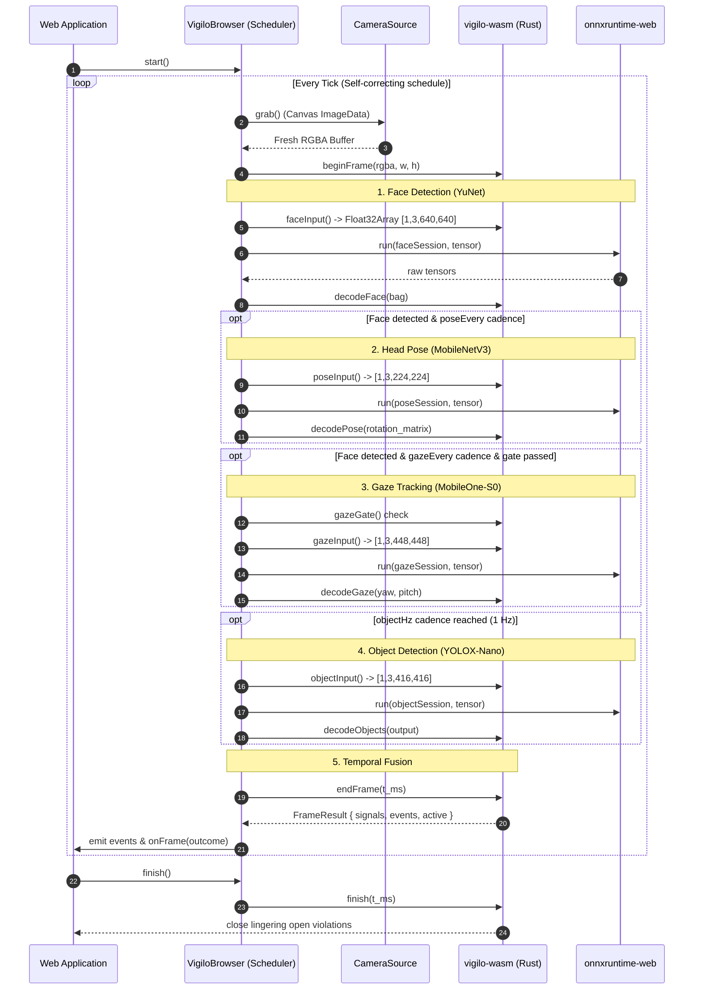

# VigiloBrowser & Scheduler

The `VigiloBrowser` class manages the detection loop in a web browser, replacing the native engine's multi-threaded pipeline (`pipeline/workers.rs`).



---

## Drop-Not-Queue Latency Guarantee

In a native environment, `vigilo-core` runs four background threads communicating over a lock-free triple-buffered frame bus. In a browser tab, everything runs within a single main-thread event loop.

To prevent latency from ballooning when neural inference takes longer than camera capture:
- **No Frame Queues**: `CameraSource.grab()` always samples the camera's *current* instantaneous frame.
- **Stale Frames Drop Automatically**: If a frame tick takes 140 ms, the next tick immediately grabs the newest frame from the camera. The pipeline never works through a backlog of old frames.
- **Bounded Latency**: End-to-end latency remains strictly bounded by a single frame's inference duration.

---

## Cadence Decoupling

Different vision models have vastly different compute costs and semantic cadences:

```ts
const vigilo = await VigiloBrowser.create({
  camera,
  models,
  faceHz: 10,     // Face detection target rate (default: 10 Hz)
  objectHz: 1,    // Object detector target rate (default: 1 Hz)
  poseEvery: 1,   // Run pose on every Nth face frame (default: 1)
  gazeEvery: 2,   // Run gaze on every Nth face frame (default: 2)
});
```

### Why `gazeEvery: 2`?
The gaze model operates on a 448×448 RGB input and is by far the most computationally expensive model (~104 ms on single-threaded WASM). Evaluating gaze every 2nd face frame reduces the average face loop latency from ~168 ms to ~116 ms, yielding ~8–9 FPS on modest CPU hardware.

### Why `objectHz: 1`?
A candidate does not flash a mobile phone or unauthorized book for only 200 ms. Prohibited objects remain in the scene for seconds. Running YOLOX-Nano at 1 Hz conserves device battery and prevents frame drops on the critical face/gaze path.

---

## Lifecycle Control

| Method | Behavior |
|---|---|
| `start()` | Begins the autonomous detection loop. |
| `stop()` | Pauses the loop without clearing temporal state. Resuming via `start()` continues the ongoing session. |
| `finish(): Event[]` | Closes the session and forces all currently open violations to emit `violation_ended` events. Essential when navigating away. |
| `reset()` | Clears temporal history and timers, resetting the fusion engine back to `t_ms = 0`. |

```ts
// Handle tab close or component unmount:
window.addEventListener('beforeunload', () => {
  const finalEvents = vigilo.finish();
  navigator.sendBeacon('/api/exam/events', JSON.stringify(finalEvents));
});
```

---

## Background Tab Detection

When a user switches away from the exam tab, browsers clamp timers to 1 Hz. Without compensation, this would appear as a sudden gap in frames.

`VigiloBrowser` monitors `visibilitychange`:
- When the tab is hidden, it immediately emits a `degraded` event with reason `camera_lost`:
  ```json
  {
    "event": "degraded",
    "reason": "camera_lost",
    "detail": "tab hidden — browser throttles the detection loop while backgrounded"
  }
  ```
- When the user switches back, it emits a `recovered` event.
- **Crucial Rule**: In proctoring, *silence must never read as innocence*. The gap is recorded as unmonitored time in the exam log.

---

## Latency HUD & Statistics

`VigiloBrowser` continuously maintains a 120-frame ring buffer of latency percentiles:

```ts
const stats = vigilo.latencies;

console.log(`Current FPS: ${stats.fps.toFixed(1)}`);
console.log(`Total Tick (p50): ${stats.total_p50.toFixed(1)}ms`);
console.log(`Total Tick (p95): ${stats.total_p95.toFixed(1)}ms`);
console.log(`Face Stage: ${stats.stages.face?.toFixed(1)}ms`);
console.log(`Pose Stage: ${stats.stages.pose?.toFixed(1)}ms`);
console.log(`Gaze Stage: ${stats.stages.gaze?.toFixed(1)}ms`);
console.log(`Object Stage: ${stats.stages.objects?.toFixed(1)}ms`);
```
