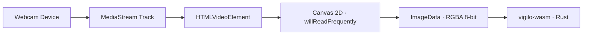

# Camera & Canvas Capture

The `CameraSource` class wraps the browser's `navigator.mediaDevices.getUserMedia` API, converting live video streams into raw RGBA byte arrays for the WebAssembly pipeline.

---

## The Capture Stack

Natively, `vigilo-core` captures via DirectShow, V4L2, or AVFoundation. In the browser, `getUserMedia` provides an already-decoded, color-managed, and hardware-accelerated video stream.



---

## Why `willReadFrequently` is Mandatory

When extracting pixels from a `<canvas>` element via `getImageData()`, modern browsers default to storing the canvas backing texture in GPU memory.

Without `willReadFrequently: true`:
- Every `getImageData()` call triggers a **synchronous GPU-to-CPU readback**.
- On high-resolution displays or discrete GPUs, this readback stall costs **15–35 ms per frame**.
- That single readback can exceed the entire latency of the YuNet face model.

`CameraSource` explicitly initializes the canvas context with:

```ts
const ctx = canvas.getContext('2d', { willReadFrequently: true });
```

This forces the browser to retain the canvas buffer in host RAM, reducing pixel access latency to sub-millisecond CPU memory copies.

---

## Opening the Camera

```ts
import { CameraSource } from 'vigilo-wasm';

// 1. Open default selfie camera (1280x720)
const camera = await CameraSource.open();

// 2. Open with custom parameters
const customCamera = await CameraSource.open({
  width: 1280,
  height: 720,
  frameRate: 30,
  facingMode: 'user', // 'user' for front-facing selfie camera
  deviceId: selectedDeviceId, // Optional: specific device from enumerateDevices()
  video: document.getElementById('camera-preview') as HTMLVideoElement,
});
```

### Ideal vs Exact Constraints
Notice that `CameraSource.open()` requests `ideal` width and height rather than `exact`. If an inexpensive USB camera only supports 640×480 or 1920×1080, an `exact` constraint causes `getUserMedia` to throw an `OverconstrainedError`, failing the candidate's exam setup. `ideal` constraints allow the browser to negotiate the closest supported mode gracefully.

---

## Resolution Trade-offs

| Resolution | Preprocessing Latency | Pose/Gaze Accuracy | Best Used For |
|---|---|---|---|
| **1280×720** (Default) | ~2.5 ms | High (sharp crops) | Standard laptops and desktops |
| **640×480** | ~1.1 ms | Good | Low-power Chromebooks or tablets |
| **1920×1080** | ~6.0 ms | Very High | High-stakes exams requiring fine gaze details |

To switch to 640×480 on low-end devices:

```ts
const camera = await CameraSource.open({ width: 640, height: 480 });
```

---

## Grabbing Frames

```ts
// Grabs the newest available frame without buffering
const image: ImageData = camera.grab();

console.log(image.width, image.height, image.data.byteLength);
```

When you are done with the session, release the webcam hardware:

```ts
camera.close();
```
