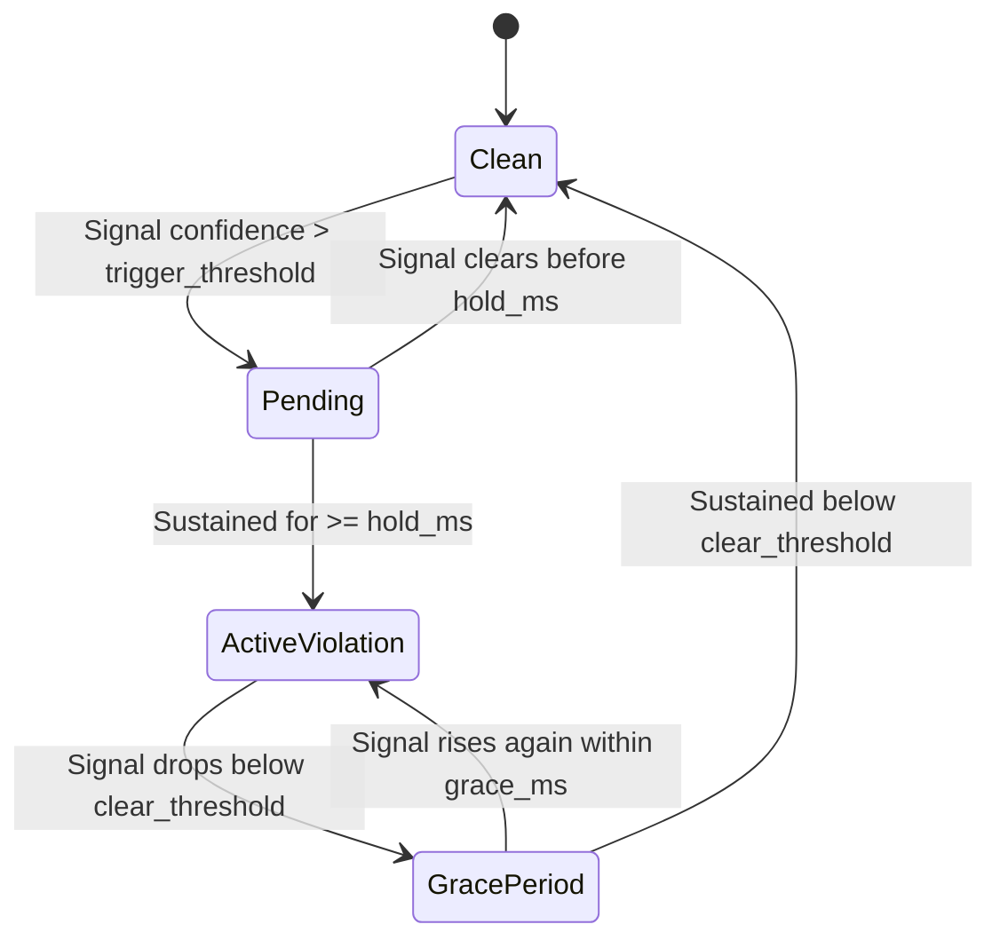

# Temporal Fusion & Replay

Instantaneous neural network predictions are inherently noisy: a candidate blinking looks like closed eyes for 100 ms, a glance at the keyboard looks like gaze diversion for 300 ms, and a transient shadow can produce a momentary false-positive face.

The **Temporal Fusion Engine** converts noisy instantaneous `Signals` into stable, defensible `Violation` events.

---

## How Temporal Fusion Works

Instead of triggering alarms on individual frames, the Rust engine uses state machines with:

1. **Hysteresis Bands**: A violation requires a high confidence threshold to open (e.g. 0.75), but does not immediately clear until confidence falls below a lower threshold (e.g. 0.40).
2. **Hold Timers**: A candidate looking away must sustain that behavior for a defined time window (e.g. 1500 ms) before a violation is declared.
3. **Score Accumulators**: Multiple weak signals (e.g. borderline head pose combined with borderline gaze deviation) reinforce each other over time.



---

## Deterministic Replay

One of the foundational design choices in Vigilo is that **temporal fusion is a pure function of inputs and discrete time (`t_ms`)**.

Given an array of recorded `Signals` and a configuration, `replay()` produces a byte-identical sequence of `Event` objects every time:

```ts
import { initVigilo, replay, type Signals, type Event } from 'vigilo-wasm';

await initVigilo();

// Load recorded signals from an exam session
const recordedSignals: Signals[] = await fetch('/api/sessions/123/signals.json')
  .then(r => r.json());

// Replay through the fusion engine with custom thresholds
const events: Event[] = replay(recordedSignals, {
  thresholds: {
    gaze_hold_ms: 2000, // Test stricter 2-second hold time
    head_turn_yaw_deg: 35.0,
  },
});

for (const event of events) {
  if (event.event === 'violation_started') {
    console.log(`Violation started at ${event.t_start_ms}ms: ${event.kind}`);
  }
}
```

### Why Determinism Matters
- **Threshold Tuning**: You can fine-tune proctoring sensitivities against a recorded benchmark corpus without re-running heavy neural inference on video files.
- **Auditability**: If a student contests an exam flag, the session signals can be independently replayed and verified by academic integrity committees.

---

## Standalone `ProctorSession`

If your application already receives signals from another source (e.g. a Web Worker, a custom WebSocket stream, or another vision model), use `ProctorSession` directly:

```ts
import { initVigilo, ProctorSession, type Signals } from 'vigilo-wasm';

await initVigilo();

const session = new ProctorSession();

// Feed signals sequentially with monotonic t_ms
function onNewSignal(signals: Signals, t_ms: number) {
  const events = session.step(signals, t_ms);
  for (const event of events) {
    handleEvent(event);
  }
}

// At exam conclusion, close any lingering violations
function endExam(final_t_ms: number) {
  const closingEvents = session.finish(final_t_ms);
  console.log('Session ended with events:', closingEvents);
}
```
