# What is Vigilo WASM?

**Vigilo WASM** is an enterprise-grade exam integrity and proctoring engine that runs **100% inside the user's browser tab**.

It ports the battle-tested Rust [`vigilo-core`](https://github.com/Abdullah-Masood-05/vigilo-core) temporal fusion engine to WebAssembly, combining it with [`onnxruntime-web`](https://onnxruntime.ai/docs/tutorials/web/) to perform real-time face detection, head pose estimation, gaze tracking, and prohibited object detection with zero server dependencies.

```mermaid
graph TD
    subgraph Browser ["Client Browser Tab — Zero Network Leakage"]
        Cam["getUserMedia<br/>1280x720"] --> Canvas["Canvas 2D<br/>willReadFrequently"]
        Canvas --> RGBA["RGBA Byte Buffer"]

        subgraph WASM1 ["vigilo-wasm"]
            Pre["Letterbox, Crop<br/>+ NCHW Pack"]
        end

        RGBA --> Pre
        Pre --> Tensor["Float32Array Tensors"]

        subgraph ORT ["onnxruntime-web"]
            Inference["Neural Inference<br/>WebGPU / SIMD"]
        end

        Tensor --> Inference
        Inference --> Out["Raw Output Tensors"]

        subgraph WASM2 ["vigilo-wasm"]
            Post["Anchor Decode,<br/>Keypoints + NMS"]
            Gate["Gaze Gating Logic"]
            Fusion["Temporal Fusion Engine"]
        end

        Out --> Post
        Post --> Gate
        Gate --> Fusion
        Fusion --> Events["Violation Events<br/>+ Signals"]
    end
```



---

## Why In-Browser Proctoring?

Traditional remote proctoring systems stream raw video feeds from examinees to centralized cloud servers or human proctors. This model creates severe operational and legal issues:

1. **Massive Cloud Costs**: Continuous video streaming and cloud GPU inference for thousands of concurrent students generates staggering infrastructure bills.
2. **Privacy & Compliance**: Streaming private living rooms, bedrooms, and faces across the Internet triggers complex GDPR, FERPA, and biometric data storage liabilities.
3. **Network Sensitivity**: A candidate with a jittery or throttled residential internet connection experiences disconnects, video degradation, and false cheating flags.

**Vigilo WASM solves this entirely:**
- **Zero Video Uploads**: Video frames never leave local machine memory. Only structured violation metadata (timestamps, violation kinds, and confidence scores) can be sent to exam servers.
- **Predictable Performance**: Compute scales with the student's own device using client-side WebGPU and multi-threaded WebAssembly.
- **Tamper Resistance**: The core decision logic resides in compiled WebAssembly, decoupled from JS tampering.

---

## Architectural Separation: Rust vs ONNX

A common pitfall in web ML projects is rewriting pipelines entirely in JavaScript or TypeScript. This introduces model drift, floating-point discrepancies, and inconsistent rule enforcement across platforms.

Vigilo WASM strictly preserves the split:
- **Matrix Multiplications**: Handled by `onnxruntime-web`, taking advantage of hardware WebGPU pipelines or WASM SIMD kernels.
- **Everything Else in Rust**: Letterboxing, aspect-ratio scaling, NCHW buffer packing, anchor decoding, non-maximum suppression (NMS), gaze gating, and temporal state machines run in compiled Rust via `wasm-bindgen`.

> [!TIP]
> The same Rust fusion engine runs both in the Python desktop package (`vigilo-stream`) and the browser package (`vigilo-wasm`). Replaying a recorded signal stream yields identical, deterministic violation events across platforms.

---

## The Model Suite

Vigilo WASM runs four coordinated neural models in the browser:

| Model | Architecture | Input Size | Format | Primary Role |
|---|---|---|---|---|
| **Face** | YuNet 2023mar | 640×640 | BGR Float32 | Bounding box & 5 facial keypoints |
| **Head Pose** | MobileNetV3-Small | 224×224 | RGB Float32 | Continuous yaw, pitch, roll angles |
| **Gaze** | MobileOne-S0 (L2CS) | 448×448 | RGB Float32 | Gaze yaw & pitch, eye-in-head angle |
| **Objects** | YOLOX-Nano | 416×416 | BGR Float32 | Cell phones, books, earbuds, notes |

### Why ArcFace (Identity) Was Dropped
In the desktop engine, a 5th model (ArcFace) performs 0.2 Hz identity verification against an enrolled photo. In the browser, ArcFace was deliberately omitted:
- It requires **13.6 MB**—larger than all other four models combined.
- Browser tabs cannot securely establish an untampered enrollment baseline without server-side cryptographic attestation.
- The `identity` slot in Vigilo WASM reports `not_configured`, signaling to the temporal engine that identity checks are omitted rather than absent.

---

## Security & Browser Context

To run Vigilo WASM in production:

1. **Secure Context Required**: The browser's `navigator.mediaDevices.getUserMedia` API is strictly restricted to `https://` origins or `localhost`.
2. **Cross-Origin Isolation (COOP & COEP)**: If you wish to use multi-threaded WASM inference in `onnxruntime-web`, your web server must serve the following headers:
   ```http
   Cross-Origin-Opener-Policy: same-origin
   Cross-Origin-Embedder-Policy: require-corp
   ```
   Without these headers, browsers disable `SharedArrayBuffer` for security reasons (Spectre mitigation), and `onnxruntime-web` falls back to single-threaded execution.
3. **Background Tab Awareness**: Browsers aggressively clamp timers (e.g. `setTimeout`, `requestAnimationFrame`) to 1 Hz when a tab is hidden. Vigilo WASM intercepts `visibilitychange` events and emits a `degraded` event with reason `camera_lost`, ensuring that a backgrounded tab is recorded as a visibility gap rather than a false period of clean behavior.
